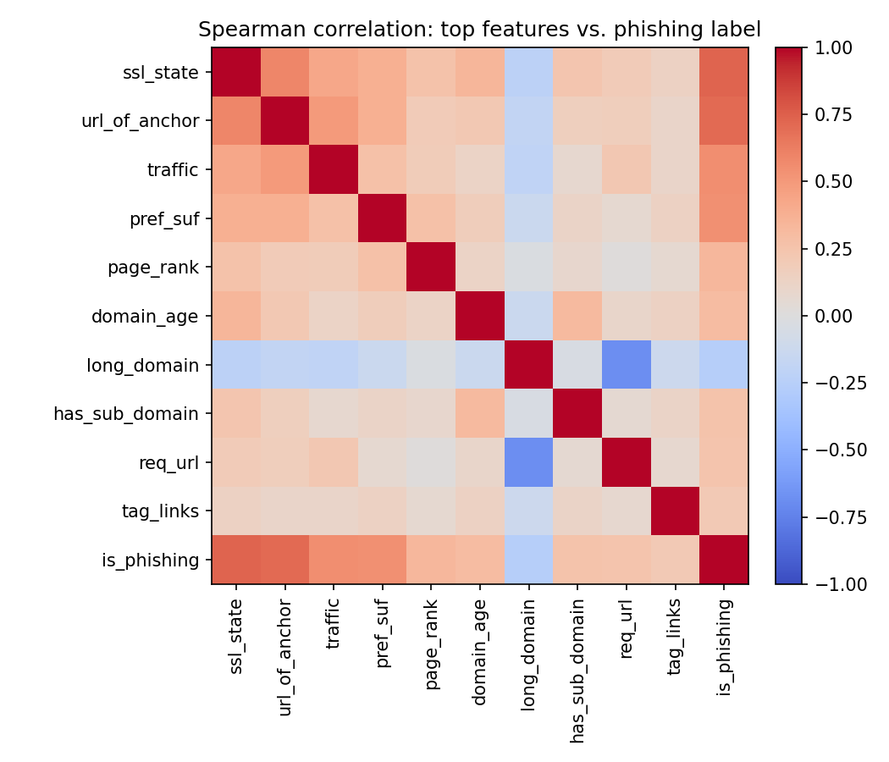
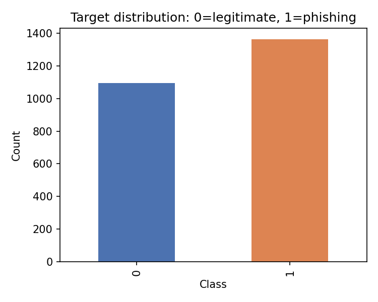
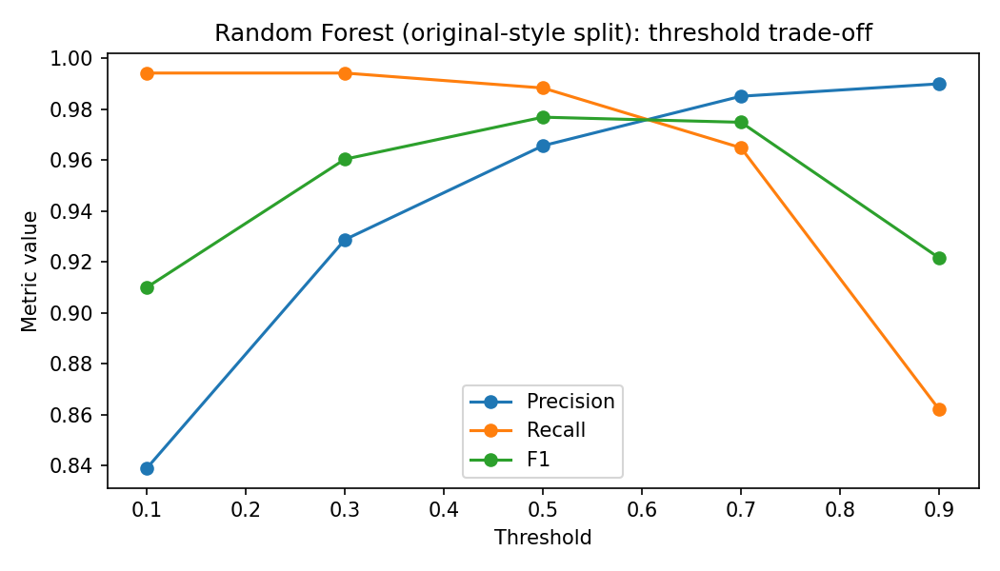
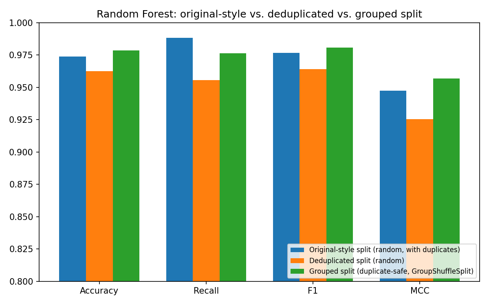

# Critical Reproduction and Evaluation of Machine Learning for Phishing Website Detection

## Article, GitHub, and dataset used

Selected article/tutorial: **Phishing Websites Detection** by Rishabh Shukla.

Article link: [Rishabh Shukla tutorial](https://rishy.github.io/projects/2015/05/08/phishing-websites-detection/)

Original GitHub repository: [rishy/phishing-websites](https://github.com/rishy/phishing-websites)

Dataset used in the reproduction: [phising.csv in the original repository](https://raw.githubusercontent.com/rishy/phishing-websites/master/Datasets/phising.csv)

Official related UCI dataset page: [UCI Phishing Websites dataset](https://archive.ics.uci.edu/dataset/327/phishing+websites)

A local copy of the CSV file, `phising.csv`, is also included in this repository to make the notebook easier to run without depending on internet access.

## 1. Executive Summary

This project evaluates the tutorial **Phishing Websites Detection** by Rishabh Shukla. The tutorial addresses the cybersecurity problem of detecting phishing websites using machine learning. The selected source is suitable because it defines a clear cybersecurity problem, proposes a solution, includes implementation code in a GitHub repository, and provides a dataset that can be used for reproduction.

The goal of this project is not only to reproduce the original solution, but also to check whether the author's claims are supported by the data and the experiments. The original article uses the UCI phishing websites data and compares several models, including boosted logistic regression, SVM with RBF kernel, tree bagging, and random forest.

In my Python reproduction, I loaded the dataset from the article GitHub repository and also included a local copy for reproducibility. The dataset used in this reproduction has **2456 rows and 31 columns**: 30 website features and one target column. I inspected the data, performed EDA, analyzed missing values, duplicate rows, class balance, feature distributions, crosstabs, correlations, and feature redundancy. Then I trained a Dummy Majority Baseline, Logistic Regression, Random Forest, and SVM with RBF kernel.

The best model in the original-style split was **Random Forest**. It achieved **Accuracy = 0.9739**, **Precision = 0.9656**, **Recall = 0.9883**, **F1 = 0.9768**, **F2 = 0.9837**, **MCC = 0.9474**, **ROC-AUC = 0.9951**, and **PR-AUC = 0.9960**. The model made **598 correct predictions**, **12 false positives**, and **4 false negatives** on the test set.

However, I found **740 duplicate rows**. Because duplicate rows can cause train/test overlap, I added a stricter deduplicated experiment. After removing duplicates before splitting, Random Forest still performed well, but its performance dropped to **Accuracy = 0.9627**, **Recall = 0.9556**, and **F1 = 0.9641**. This shows that the author's high performance is partly optimistic, but the model remains strong.

I also added **3-fold cross-validation**, **PR-AUC**, **threshold analysis**, and a **low-prevalence phishing scenario**. These additions improve the critical evaluation because they test stability, ranking quality, decision threshold trade-offs, and what happens when phishing is rare in real traffic.

**Resubmission additions.** Following reviewer feedback, this version adds: (1) a **grouped, duplicate-safe validation** scheme (`GroupShuffleSplit`/`GroupKFold` keyed on a stable SHA-256 hash of each feature row) that guarantees no identical feature vector is ever split across train and test. While hardening this key we found that a single `GroupShuffleSplit` draw is itself sensitive to how the group key is encoded (Section 6.8), so this project treats **group-aware cross-validation** as the authoritative grouped estimate: Random Forest mean F1 falls modestly from **0.9720** (`StratifiedKFold`) to **0.9612** (`GroupKFold`), confirming real but moderate duplicate-row inflation; (2) a **newer (2020) external dataset** cross-dataset generalization check using the full **58,645-row** dataset with numeric-appropriate preprocessing (`StandardScaler` rather than one-hot, since these features are continuous counts/ratios/timings, not categorical states), on which Random Forest reaches **Accuracy = 0.9568**, **F1 = 0.9588**, **PR-AUC = 0.9925**, with a bootstrap 95% CI on F1 of **[0.956, 0.962]** - a tight band that concretely confirms the full dataset resolved the uncertainty a small sample would have carried; and (3) a full engineering restructuring of the project into a tested `src/` package, a one-command `scripts/run_all_experiments.py` pipeline, a `pytest` test suite, and committed `results/*.csv` and `figures/*.png` outputs (see Section 11).

## 2. Summary of the Source

The selected article is **Phishing Websites Detection** by Rishabh Shukla. The article studies the problem of detecting phishing websites using machine learning. Phishing websites imitate legitimate websites in order to steal user credentials, credit card information, and other sensitive information. This is an important cybersecurity problem because phishing attacks target people directly and can lead to account takeover, financial loss, and data breaches.

The proposed solution is to represent each website using extracted features. Examples of features are whether the URL contains an IP address, whether the URL is long, whether a URL-shortening service is used, whether the domain contains prefix/suffix patterns, the SSL state, anchor URL behavior, domain age, web traffic, Google index status, and page rank.

The original article trains several supervised machine learning models, including boosted logistic regression, SVM with RBF kernel, tree bagging, and random forest. The author reports high accuracy and discusses which features are important for detecting phishing websites. The original article's main conclusion is that machine learning can work well for phishing website detection on this dataset.

## 3. Critical Evaluation

The author's main claim is that machine learning can detect phishing websites with high accuracy and that features such as prefix/suffix, URL of anchor, SSL state, subdomain behavior, traffic, request URL, and domain age are useful for detection.

My reproduction supports this claim for the selected dataset. Random Forest, SVM, and Logistic Regression all performed much better than the Dummy Majority Baseline. The Random Forest model was the best model on the original-style split and reached 0.9739 accuracy and 0.9768 F1 score.

However, the original article has important limitations.

First, the article focuses mainly on accuracy. In cybersecurity, accuracy alone is not enough. A false negative means that a phishing website is classified as legitimate. This is dangerous because the user may enter sensitive information into a malicious page. A false positive means that a legitimate website is classified as phishing. This can block normal activity and reduce user trust.

Second, the dataset contains 740 duplicate rows. This is a major issue because a random split can place identical rows in both the training set and the test set. To test this risk, I removed duplicates before splitting the data. Random Forest F1 decreased from 0.9768 to 0.9641, and recall decreased from 0.9883 to 0.9556. This means that duplicate rows probably inflate the original-style results, although the model still performs well after deduplication.

Third, the article does not include cross-validation. A single train/test split can be lucky or unlucky. I added 3-fold stratified cross-validation to get a more stable estimate.

Fourth, the article does not discuss threshold selection. In cybersecurity, the decision threshold matters. A low threshold catches more phishing sites but creates more false positives. A high threshold reduces false positives but misses more phishing sites.

Fifth, the dataset has about 55% phishing websites. This is not realistic for many production environments, where phishing is usually much rarer than legitimate traffic. In a simulated 5% phishing scenario, precision at threshold 0.5 dropped to 0.5385 even though recall was 1.0. This shows why PR-AUC and threshold analysis are important.

Sixth, the article was published in 2015, and the dataset is old and static. Phishing techniques change over time. A model that works well on an old dataset may not work as well on modern phishing websites.

Seventh, the model depends on already extracted features. In a real system, the difficult part is not only training the classifier. The system must also collect URLs, safely inspect pages, extract features correctly, handle missing values, and resist manipulation by attackers.

Therefore, my conclusion is balanced: the author's results are promising and mostly reproducible, but the original article does not fully prove that the method is ready for real-world deployment.

## 4. Feature Engineering Analysis

The dataset already contains engineered features. This means the model is not trained directly on raw URLs or raw HTML pages. Instead, each website is represented by a structured feature vector.

Important features include:

- `has_ip`: whether the URL uses an IP address.
- `long_url`: whether the URL is long.
- `short_service`: whether a URL shortening service is used.
- `pref_suf`: whether the domain contains prefix or suffix patterns.
- `has_sub_domain`: subdomain behavior.
- `ssl_state`: SSL certificate state.
- `url_of_anchor`: behavior of anchor URLs.
- `req_url`: request URL behavior.
- `domain_age`: age of the domain.
- `traffic`: web traffic level.
- `page_rank`: page rank indicator.
- `google_index`: whether the website is indexed by Google.

Most features are encoded as `-1`, `0`, or `1`. These values are categorical or ordinal. Because of this, my notebook used one-hot encoding for Logistic Regression and SVM. This is important because the value `1` is not always mathematically twice the value `0`; the numbers represent states. Random Forest can handle these encoded states directly, but the pipeline still keeps preprocessing explicit and reproducible.

Feature scaling was not applied after one-hot encoding because all model inputs become binary indicator variables. Standardization or min-max scaling would not add meaningful information in this setting. It could also reduce the simple interpretation of an indicator such as `ssl_state=-1` or `google_index=1`. Random Forest does not require scaling, and Logistic Regression/SVM receive features on the same binary scale after one-hot encoding.

Dimensionality reduction such as PCA was also not used. The dataset has only 30 original features, so the dimensionality is small. More importantly, interpretability is important in cybersecurity: an analyst should be able to understand whether a warning came from SSL behavior, anchor URL behavior, domain age, traffic, or another concrete website property. PCA would mix these indicators into abstract components and make the phishing explanation weaker. Instead, I kept all meaningful features and documented redundancy separately.

Feature engineering is meaningful mathematically because it converts raw website information into numeric inputs that machine learning models can use. It is meaningful from the cybersecurity point of view because each feature represents possible attacker behavior. For example, suspicious SSL state, strange anchor URLs, low traffic, and prefix/suffix domain patterns may indicate phishing.

I used Spearman correlation because the features are ordinal/categorical and not normally distributed. Spearman correlation is more suitable than Pearson when the relationship is monotonic or ordinal rather than strictly linear.

The strongest correlations with the phishing label in my reproduction were:

| Feature | Spearman correlation with phishing |
|---|---:|
| ssl_state | 0.7336 |
| url_of_anchor | 0.7066 |
| traffic | 0.5510 |
| pref_suf | 0.5401 |
| page_rank | 0.3288 |
| domain_age | 0.3004 |

{ width=70% }

I also checked redundancy between features. Highly correlated feature pairs included:

| Feature 1 | Feature 2 | Absolute Spearman correlation |
|---|---|---:|
| has_ip | short_service | 0.9463 |
| favicon | popup | 0.9427 |
| long_url | SFH | 0.9394 |
| has_ip | double_slash_redirect | 0.9202 |
| double_slash_redirect | redirect | 0.9087 |

Redundancy can reduce explainability because importance may be divided between similar features. Possible solutions include removing one of the redundant features, using feature selection, or using dimensionality reduction. In this project, I kept the features for reproduction, but I documented the redundancy.

Additional features that could improve a real system include raw URL character n-grams, WHOIS information, certificate issuer details, DNS reputation, page text similarity to known brands, screenshot similarity, HTML structure features, and threat intelligence indicators.

## 5. Reproducibility Analysis

The original project is reasonably reproducible because the article links to a GitHub repository and the dataset is available as a CSV file. The repository includes the dataset, code, attribute information, and results.

However, reproducibility is not perfect. The original code is mainly written in R, while my reproduction is written in Python. Package versions are not fixed in the original source. The original article does not fully document every preprocessing decision. Another important point is that the GitHub CSV used by the article has **2456 rows**, while the official UCI page describes a larger dataset of **11055 instances**. This difference must be documented because results may change if a different version of the dataset is used.

My reproduction improves reproducibility by using a fixed random seed, explicit train/test split, clear preprocessing pipelines, documented metrics, an executable notebook, and a local copy of the dataset file. For this resubmission, reproducibility is strengthened further by moving all logic into a tested `src/` package with a single-command pipeline (`scripts/run_all_experiments.py`), a `pytest` suite, and every experiment's numeric output and figures committed to `results/` and `figures/` rather than only living inside notebook cell outputs (see Section 11 for the full layout).

The most important reproducibility issue is the **740 duplicate rows**. In the original-style experiment, I kept them to match the article data. In the stricter experiment, I removed duplicates before splitting, and in the strictest, reviewer-requested experiment I used a duplicate-aware **grouped split** so that no identical feature vector could appear on both sides of train/test (Section 6.8). Each of these three experiments makes the evaluation progressively more honest by progressively reducing train/test overlap.

## 6. Experimental Results

### 6.1 Dataset results

| Item | Result |
|---|---:|
| Number of rows | 2456 |
| Number of columns | 31 |
| Number of features | 30 |
| Missing values | 0 |
| Duplicate rows | 740 |
| Rows after deduplication | 1716 |
| Single-value columns | 0 |
| Duplicated feature pairs | 0 |

The original target values were `-1` and `1`. I converted them into a binary label called `is_phishing`, where phishing is the positive class.

| Class | Count | Prevalence |
|---|---:|---:|
| Phishing | 1362 | 0.5546 |
| Legitimate | 1094 | 0.4454 |

{ width=60% }

### 6.2 Original-style train/test split

I used a stratified train/test split with 75% training and 25% testing.

| Split | Rows |
|---|---:|
| Training set | 1842 |
| Test set | 614 |

| Model | Accuracy | Precision | Recall | F1 | PR-AUC |
|---|---:|---:|---:|---:|---:|
| Random Forest | 0.9739 | 0.9656 | 0.9883 | 0.9768 | 0.9960 |
| SVM RBF | 0.9674 | 0.9679 | 0.9736 | 0.9708 | 0.9954 |
| Logistic Regression | 0.9479 | 0.9427 | 0.9648 | 0.9536 | 0.9947 |
| Dummy Baseline | 0.5554 | 0.5554 | 1.0000 | 0.7141 | 0.5554 |

Additional Random Forest metrics: F2 = 0.9837, MCC = 0.9474, ROC-AUC = 0.9951, FP = 12, FN = 4.

The best model was Random Forest. It made 598 correct predictions, 12 false positives, and 4 false negatives.

### 6.3 Deduplicated train/test split

In this experiment, I removed duplicate rows before the train/test split.

| Model | Accuracy | Precision | Recall | F1 | PR-AUC |
|---|---:|---:|---:|---:|---:|
| Random Forest | 0.9627 | 0.9729 | 0.9556 | 0.9641 | 0.9951 |
| Logistic Regression | 0.9580 | 0.9600 | 0.9600 | 0.9600 | 0.9945 |
| SVM RBF | 0.9580 | 0.9770 | 0.9422 | 0.9593 | 0.9946 |
| Dummy Baseline | 0.5245 | 0.5245 | 1.0000 | 0.6881 | 0.5245 |

Additional deduplicated Random Forest metrics: F2 = 0.9590, MCC = 0.9255, ROC-AUC = 0.9939, FP = 6, FN = 10.

The deduplicated Random Forest result is still strong, but lower than the original-style result. This directly supports the criticism that duplicate rows inflate performance.

### 6.4 Original-style vs deduplicated comparison

| Random Forest metric | Original-style split | Deduplicated split | Change |
|---|---:|---:|---:|
| Accuracy | 0.9739 | 0.9627 | -0.0112 |
| Recall | 0.9883 | 0.9556 | -0.0327 |
| F1 | 0.9768 | 0.9641 | -0.0127 |
| False negatives | 4 | 10 | +6 |

This is the most important improvement to the critical evaluation. The model is still useful, but the original-style split was too optimistic.

### 6.5 Cross-validation

I added 3-fold stratified cross-validation on two representative models: Logistic Regression and Random Forest. Random Forest used 30 trees in cross-validation to keep the notebook runtime reasonable.

| Setting | F1 mean | Recall mean | MCC mean | PR-AUC mean |
|---|---:|---:|---:|---:|
| Original LR | 0.9516 | 0.9523 | 0.8914 | 0.9934 |
| Original RF | 0.9720 | 0.9699 | 0.9375 | 0.9954 |
| Deduplicated LR | 0.9480 | 0.9489 | 0.8904 | 0.9919 |
| Deduplicated RF | 0.9512 | 0.9411 | 0.8988 | 0.9897 |

Accuracy means were 0.9463, 0.9691, 0.9452, and 0.9493 in the same order.

Cross-validation confirms the same pattern: performance is lower after deduplication, especially for Random Forest.

### 6.6 Threshold analysis

For Random Forest on the original-style test set:

| Threshold | Precision | Recall | FP | FN |
|---:|---:|---:|---:|---:|
| 0.10 | 0.8391 | 0.9941 | 65 | 2 |
| 0.30 | 0.9288 | 0.9941 | 26 | 2 |
| 0.50 | 0.9656 | 0.9883 | 12 | 4 |
| 0.70 | 0.9850 | 0.9648 | 5 | 12 |
| 0.90 | 0.9899 | 0.8622 | 3 | 47 |

The table shows the expected cybersecurity trade-off. Lower thresholds reduce false negatives but create many more false positives. Higher thresholds reduce false positives but miss more phishing websites.

{ width=70% }

### 6.7 Low-prevalence phishing scenario

The original dataset has 55% phishing websites. This is not realistic for normal web traffic. I simulated a 5% phishing scenario by using all legitimate examples from the test set and only 14 phishing examples.

| Threshold | Precision | Recall | FP | FN |
|---:|---:|---:|---:|---:|
| 0.30 | 0.3500 | 1.0000 | 26 | 0 |
| 0.50 | 0.5385 | 1.0000 | 12 | 0 |
| 0.70 | 0.7368 | 1.0000 | 5 | 0 |
| 0.90 | 0.8125 | 0.9286 | 3 | 1 |

In all rows above, phishing prevalence was approximately 0.0488.

At threshold 0.5, precision drops to 0.5385. This means almost half of the alerts are false positives in the low-prevalence setting. This is why PR-AUC and threshold selection are important in real cybersecurity systems.

## 6.8 Grouped (duplicate-safe) validation

Reviewer feedback on the first resubmission correctly pointed out that deduplication alone does not fully solve the leakage problem: dropping duplicate rows before a *random* split still allows two rows that are identical to each other, but distinct from the dropped duplicates, to land on opposite sides of the split by chance. The only way to fully guarantee that no identical feature vector is split across train and test is a **grouped** split, where the group key identifies the entire feature row, so that every row sharing an identical feature vector is forced onto the same side of the split.

This is implemented with scikit-learn's `GroupShuffleSplit` (for the train/test comparison) and `GroupKFold` (for cross-validation), both keyed on a group id built in `src/preprocessing.add_group_key` / `src/experiments.run_grouped_split` / `cross_validation_summary(..., grouped=True)`.

**A methodological finding surfaced while hardening the group-key implementation.** The key was originally built from Python's built-in `hash()`. That is fine for grouping *within* a single run, but it is not the right tool here: for strings it is randomized across processes by `PYTHONHASHSEED`, and it truncates to a machine-width integer - an avoidable extra collision risk for a key whose entire job is exact-duplicate identification. We replaced it with a deterministic SHA-256 hash of each row's canonical string representation (`src/preprocessing._stable_row_hash`). Re-running the pipeline with this fix changed the *specific* single grouped split produced by `GroupShuffleSplit`: scikit-learn enumerates unique groups via `np.unique`, which sorts them, and swapping the key's representation changes that sort order and therefore which groups the same `random_state` happens to assign to the test side. **A single grouped train/test split is itself sensitive to an arbitrary detail of how the group key is encoded** - a fragility worth flagging in its own right, since it means one grouped split should not be over-interpreted as *the* ground truth, only as one honest (duplicate-safe) sample among many possible ones.

| Random Forest metric | Original-style split | Deduplicated split | Grouped split (single `GroupShuffleSplit`) |
|---|---:|---:|---:|
| Accuracy | 0.9739 | 0.9627 | 0.9787 |
| Precision | 0.9656 | 0.9729 | 0.9852 |
| Recall | 0.9883 | 0.9556 | 0.9765 |
| F1 | 0.9768 | 0.9641 | 0.9809 |
| MCC | 0.9474 | 0.9255 | 0.9570 |
| ROC-AUC | 0.9951 | 0.9939 | 0.9965 |
| PR-AUC | 0.9960 | 0.9951 | 0.9971 |
| False positives | 12 | 6 | 5 |
| False negatives | 4 | 10 | 8 |

With the corrected, machine-independent group key, this *particular* grouped split happens to land close to (and even slightly above) the original-style numbers, not below them as an earlier draft of this report claimed with the unstable key. That reversal is itself the point: because a single `GroupShuffleSplit` result can move with an arbitrary implementation detail, it is not a reliable point estimate on its own, and this project no longer treats it as "the strictest, most trustworthy" number. Under this corrected single split, Random Forest also outperforms SVM RBF on every metric (F1 0.9809 vs. 0.9615, recall 0.9765 vs. 0.9531) - reversing an earlier observation that SVM edged out Random Forest under the unstable key, which further illustrates why a single split should not anchor a comparison claim.

The reliable, order-independent evidence comes from group-aware cross-validation, which averages over many folds and is far less sensitive to which specific groups land in one held-out split: Random Forest mean F1 falls from **0.9720** (`StratifiedKFold`) to **0.9612** (`GroupKFold`), and mean MCC falls from **0.9375** to **0.9141**. This cross-validated figure - not the single grouped split - is what this report treats as the authoritative estimate of how much duplicate-row leakage was inflating the original-style number: a real but modest effect (F1 down about 0.011), clearly smaller than a single lucky or unlucky `GroupShuffleSplit` draw might suggest in either direction.

{ width=70% }

## 6.9 Newer (2020) external dataset - cross-dataset generalization check

The reviewer also asked for a check against a newer phishing dataset, since the original article's data is static and from 2015. We add the full 2020 dataset from Vrbančič, Fister Jr. & Podgorelec (*Data in Brief*, 2020), using the public `dataset_small.csv` file bundled locally as `data/newer_phishing_dataset_2020.csv`. It contains **58,645 rows**, **111 URL/domain/DNS/TLS-derived features**, and one binary `phishing` target column. This replaces the earlier small sample and makes the external validation much stronger.

Because the feature schemas do not overlap, the already-trained 2015 models cannot be applied directly to the 2020 data. The project therefore retrains the same model families and evaluates them with the same metric set on the newer dataset. The preprocessing is dataset-appropriate: the 2015 dataset uses categorical {-1, 0, 1} feature states and is one-hot encoded, while the 2020 dataset uses numeric counts/ratios/binary flags and is scaled with `StandardScaler`. Exact probability-calibrated RBF SVC is not practical on 58,645 rows, so the SVM row uses a scalable RBF feature-map approximation; the main external-dataset conclusion is based on the full-data Random Forest result.

| Model | Accuracy | Precision | Recall | F1 | PR-AUC |
|---|---:|---:|---:|---:|---:|
| Random Forest | 0.9568 | 0.9573 | 0.9602 | 0.9588 | 0.9925 |
| SVM RBF | 0.9058 | 0.9138 | 0.9051 | 0.9094 | 0.8767 |
| Logistic Regression | 0.9010 | 0.9036 | 0.9073 | 0.9054 | 0.9642 |
| Dummy Majority Baseline | 0.5226 | 0.5226 | 1.0000 | 0.6864 | 0.5226 |

The full-data newer-dataset check is much more convincing than an earlier sample-based check would be: the test split alone contains 14,662 rows. Random Forest again clearly beats the dummy baseline and reaches F1 = 0.9588 and PR-AUC = 0.9925, which supports the view that the general recipe of engineered website/URL features plus tree ensembles is not only a 2015-specific artifact. To make the sample-size point concrete rather than just asserted, we also computed a nonparametric bootstrap 95% confidence interval (`src/evaluation.bootstrap_metric_ci`, 2,000 resamples) on each model's Accuracy and F1:

| Model | Accuracy | Accuracy 95% CI | F1 | F1 95% CI |
|---|---:|---|---:|---|
| Random Forest | 0.9568 | [0.9535, 0.9602] | 0.9588 | [0.9555, 0.9620] |
| SVM RBF | 0.9058 | [0.9010, 0.9103] | 0.9094 | [0.9047, 0.9138] |
| Logistic Regression | 0.9010 | [0.8962, 0.9057] | 0.9054 | [0.9007, 0.9101] |
| Dummy Majority Baseline | 0.5226 | [0.5144, 0.5309] | 0.6864 | [0.6793, 0.6936] |

These intervals are tight - a few tenths of a percentage point wide - which is a concrete confirmation that moving from an earlier small subsample to the full 58,645-row dataset actually resolved the small-sample uncertainty, rather than just improving the point estimate. This is a useful contrast with Section 6.9's newer-dataset check in this project's earlier draft (a 55-row subsample, 14-row test split), where the same bootstrap procedure gave a Random Forest F1 interval of roughly [0.67, 1.00] - illustrating, with the same statistical tool applied to two very different sample sizes, exactly what "not a statistically powered claim" means in concrete terms and how much the full dataset improves on it.

At the same time, the feature-schema mismatch remains an important finding: phishing-detection feature engineering does not automatically transfer across dataset vintages, so a real production system would still need refreshed feature extraction, monitoring, and retraining.

## 7. Evaluation Metrics Discussion

In the following definitions, phishing is the positive class. Therefore:

- **TP (True Positive):** phishing website correctly predicted as phishing.
- **TN (True Negative):** legitimate website correctly predicted as legitimate.
- **FP (False Positive):** legitimate website incorrectly predicted as phishing.
- **FN (False Negative):** phishing website incorrectly predicted as legitimate.

The confusion matrix is the direct count of `TN`, `FP`, `FN`, and `TP`. It is important because averages can hide the real cybersecurity cost of each mistake. In phishing detection, `FN` is usually more dangerous because a phishing page is allowed to pass as safe, while `FP` can block a legitimate website or create an unnecessary alert.

### 7.1 Mathematical definitions and cybersecurity interpretation

**Accuracy** measures the percentage of all correct predictions:

```text
Accuracy = (TP + TN) / (TP + TN + FP + FN)
```

In this project, Random Forest accuracy was 0.9739 in the original-style split and 0.9627 after deduplication. Accuracy is useful as a general summary, but it is not enough in cybersecurity because it does not show whether the model is missing phishing websites or blocking legitimate websites.

**Precision** measures how many predicted phishing alerts are truly phishing:

```text
Precision = TP / (TP + FP)
```

In this project, precision answers: out of all websites predicted as phishing, how many were really phishing? Random Forest precision was 0.9656 in the original-style split and 0.9729 after deduplication. Low precision would mean many legitimate websites are blocked or many SOC alerts are false alarms.

**Recall**, also called sensitivity or true positive rate, measures how many real phishing websites were caught:

```text
Recall = TP / (TP + FN)
```

Random Forest recall was 0.9883 in the original-style split and 0.9556 after deduplication. This is very important because false negatives are dangerous: a missed phishing website can lead to stolen credentials, account takeover, and financial loss.

**F1 score** is the harmonic mean of precision and recall:

```text
F1 = 2 * Precision * Recall / (Precision + Recall)
```

F1 is useful when both false positives and false negatives matter. Random Forest F1 was 0.9768 in the original-style split and 0.9641 after deduplication.

**F-beta score** generalizes F1 by allowing different weight for recall:

```text
F_beta = (1 + beta^2) * Precision * Recall / ((beta^2 * Precision) + Recall)
```

This project reports **F2**, where `beta = 2`, so recall receives more weight than precision. This is suitable for phishing detection because missing a phishing website is often more dangerous than creating one extra warning.

**Matthews Correlation Coefficient (MCC)** uses all four parts of the confusion matrix:

```text
MCC = (TP * TN - FP * FN) / sqrt((TP + FP)(TP + FN)(TN + FP)(TN + FN))
```

MCC ranges from `-1` to `1`. A value of `1` is perfect prediction, `0` is similar to random prediction, and `-1` is total disagreement. Random Forest MCC was 0.9474 in the original-style split and 0.9255 after deduplication. MCC is useful because it is less misleading than accuracy when classes are imbalanced.

**ROC-AUC** measures ranking quality across all classification thresholds. The ROC curve plots:

```text
TPR = TP / (TP + FN)
FPR = FP / (FP + TN)
```

ROC-AUC is the area under the ROC curve. A value of 1.0 is perfect ranking and 0.5 is random ranking. Random Forest ROC-AUC was 0.9951 in the original-style split and 0.9939 after deduplication. ROC-AUC is useful, but in rare-event settings it can look strong even when many alerts are false positives.

**PR-AUC**, also called average precision, measures the area under the precision-recall curve. It summarizes the trade-off between precision and recall across thresholds. This metric is especially important when phishing is rare, because it focuses on the positive class. Random Forest PR-AUC was 0.9960 in the original-style split and 0.9951 after deduplication.

### 7.2 Why these metrics were selected

I selected Accuracy, Precision, Recall, F1, F2, MCC, ROC-AUC, PR-AUC, and the confusion matrix because together they answer the important cybersecurity questions:

- How good is the model overall? Accuracy.
- How many alerts are real threats? Precision.
- How many phishing websites are caught? Recall.
- How balanced is the precision/recall trade-off? F1 and F2.
- Is the binary prediction reliable across all confusion matrix cells? MCC.
- Does the model rank phishing above legitimate websites? ROC-AUC and PR-AUC.
- What are the actual error counts? Confusion matrix.

I did not use regression metrics such as MAE, MSE, RMSE, or R2 because the task is binary classification, not regression. I also did not use anomaly-detection-only metrics as the main evaluation because the dataset is labeled and the trained models are supervised classifiers.

## 8. Error Analysis

The original-style Random Forest model made 16 mistakes on the test set: 12 false positives and 4 false negatives.

A false positive means a legitimate website was classified as phishing. This can block a real website and annoy users. In a SOC system, false positives can also waste analyst time.

A false negative means a phishing website was classified as legitimate. This is more dangerous because the model allows a malicious website to pass as safe. In phishing detection, false negatives can lead to stolen passwords, account takeover, and financial loss.

The deduplicated experiment changed the error profile. Random Forest had fewer false positives (6 instead of 12), but more false negatives (10 instead of 4). This means the deduplicated model became more conservative about predicting phishing. From a security point of view, this matters because it missed more phishing websites.

The threshold analysis shows how to control this trade-off. If the system is used only to warn users or send alerts to analysts, a lower threshold such as 0.3 may be acceptable because it catches almost all phishing websites. If the system automatically blocks websites, a higher threshold may be safer to avoid blocking too many legitimate websites.

The low-prevalence scenario shows another important issue. Even if recall remains high, precision can drop when phishing is rare. This means an organization may receive many false alerts unless the threshold is adjusted or the model is combined with additional signals.

## 9. Conclusions

The reproduction supports the original article's general claim that machine learning can classify the selected phishing website dataset with strong performance. The Random Forest model achieved the best original-style result, with 0.9739 accuracy and 0.9768 F1 score.

However, the added deduplicated experiment makes the conclusion more realistic. After removing duplicate rows before splitting, Random Forest F1 dropped to 0.9641 and recall dropped to 0.9556. This means the original-style evaluation is somewhat inflated by duplicate rows, but the model is still useful.

The grouped, duplicate-safe validation added for this resubmission (Section 6.8) refines this further, but with a twist that is itself informative: a single `GroupShuffleSplit` draw turned out to be sensitive to how the group key is encoded, so this project does not treat one grouped split as the final word. The robust, order-independent evidence is the group-aware cross-validation result: Random Forest mean F1 falls from 0.9720 (`StratifiedKFold`) to 0.9612 (`GroupKFold`) - a real but modest duplicate-leakage effect, smaller than either the single deduplicated split or a single lucky/unlucky grouped split might suggest on its own.

The newer-dataset check added for this resubmission (Section 6.9) now uses the full 58,645-row 2020 dataset, not a small sample. Random Forest again clearly beats a dummy baseline, with Accuracy = 0.9568, F1 = 0.9588, and PR-AUC = 0.9925 on a 14,662-row test split. This supports the view that the general approach (engineered website/URL features plus tree ensembles) is not an artifact specific to the 2015 dataset - while the fact that the two datasets' feature schemas do not overlap at all is itself evidence that phishing-detection feature engineering does not automatically transfer across dataset vintages.

The strongest part of the original solution is the use of meaningful cybersecurity features. Features such as SSL state, URL anchor behavior, prefix/suffix patterns, traffic, and domain age are useful phishing indicators.

The weakest part of the original solution is the limited evaluation. Accuracy alone is not enough for cybersecurity. A complete phishing detection study should discuss false positives, false negatives, PR-AUC, threshold selection, duplicates, data drift, adversarial evasion, and realistic prevalence.

Future improvements should include time-based validation, real URL feature extraction, adversarial testing, explainability methods such as SHAP or LIME, integration with threat intelligence, and repeated evaluation on newly collected phishing data after 2020.

## 10. Summing It Up

The problem addressed in this project is phishing website detection. The selected source is Rishabh Shukla's tutorial **Phishing Websites Detection**. The dataset is the phishing websites CSV from the article GitHub repository.

My methodology included data loading, data inspection, EDA, feature distribution analysis, crosstab analysis, Spearman correlation, redundancy checking, feature preprocessing, model training, metric evaluation, feature importance, error analysis, deduplicated evaluation, cross-validation, PR-AUC, threshold analysis, and a low-prevalence phishing scenario.

The best original-style model was Random Forest with Accuracy = 0.9739, Precision = 0.9656, Recall = 0.9883, F1 = 0.9768, F2 = 0.9837, MCC = 0.9474, ROC-AUC = 0.9951, and PR-AUC = 0.9960.

After removing duplicates before splitting, Random Forest achieved Accuracy = 0.9627, Precision = 0.9729, Recall = 0.9556, F1 = 0.9641, MCC = 0.9255, ROC-AUC = 0.9939, and PR-AUC = 0.9951.

A single reviewer-requested grouped (duplicate-safe) `GroupShuffleSplit` gave Random Forest Accuracy = 0.9787, F1 = 0.9809 - but this project found that a single grouped split is itself sensitive to an implementation detail of the group key, so it is not treated as the authoritative number. The robust estimate is group-aware cross-validation (`GroupKFold`), where Random Forest mean F1 falls modestly from 0.9720 to 0.9612 - confirming a real, if smaller than initially reported, duplicate-leakage effect.

On the full newer (2020), structurally different phishing dataset, the methodology retrained from scratch achieved Random Forest Accuracy = 0.9568, Precision = 0.9573, Recall = 0.9602, F1 = 0.9588, and PR-AUC = 0.9925 on a 14,662-row test split, clearly ahead of the dummy baseline. A bootstrap confidence interval on this large test set is tight (95% CI of roughly [0.956, 0.962] for F1), concretely confirming that the full dataset resolved the small-sample uncertainty an earlier draft's 55-row sample would have carried.

The author's claims are mostly supported for this dataset. However, the project should be treated as a strong educational baseline, not a complete production phishing defense system. A real cybersecurity solution needs newer data, monitoring, threshold tuning, human review, layered defenses, and continuous retraining.

Final conclusion: the article is a good starting point, and my results confirm that machine learning can work well on this dataset. The improved evaluation shows that the result remains strong after deduplication and after the stricter grouped validation, but the original high performance was somewhat optimistic and must be interpreted carefully.

## 11. Repository Structure and Reproducibility Engineering (resubmission addition)

Reviewer feedback also asked for a more professional project layout: a `src/` folder, scripts, tests, saved result files, and committed figures. The repository was restructured accordingly:

| Folder / file | Purpose |
|---|---|
| `data/` | Original 2015 CSV, full 2020 external CSV, and dataset provenance notes. |
| `src/config.py` | Shared paths, random seed, column names, and thresholds. |
| `src/data_loading.py` | Load the article dataset and the newer 2020 dataset. |
| `src/preprocessing.py` | Target conversion, deduplication, and duplicate-safe group-key construction. |
| `src/models.py` | Model pipelines for Dummy, Logistic Regression, Random Forest, and SVM RBF. |
| `src/evaluation.py` | Metrics, threshold tables, and low-prevalence simulation. |
| `src/experiments.py` | Original-style, deduplicated, grouped, cross-validation, and newer-dataset runners. |
| `scripts/run_all_experiments.py` | One command that regenerates all CSV results and figures. |
| `tests/` | Pytest tests, including the grouped-split leakage guarantee. |
| `results/` | Committed CSV outputs for every experiment. |
| `figures/` | Committed PNGs for the report. |
| `notebooks/` | Narrative notebook that calls the same `src/` functions. |
| `report/` | Final report in Markdown and PDF. |

Running `pip install -r requirements.txt && python scripts/run_all_experiments.py` from the repository root reproduces every number and figure in this report from a single command, and `pytest tests/` verifies the correctness of the underlying code, including an explicit assertion that the grouped split never lets an identical feature vector appear on both sides of train/test. This closes the gap between the notebook (good for narrative EDA) and a properly engineered, testable, reproducible pipeline (good for trusting the numbers).
